

# GoGung (go + 宮)

#### VR 기반 경복궁 문화 체험 어플리케이션
> <b>경복궁</b>에 관심있는 사람이,  
> 스스로 <b>원하는 시간과 장소</b>에서,  
> 풍부한 <b>궁중 문화</b>를 경험할 수 있는,   
> <b>VR 기반 경복궁 문화체험 어플리케이션</b>

 

## 프로젝트 목차

- [1️⃣ 프로젝트 소개](#1️⃣-프로젝트-소개)
  
   
  
- [2️⃣ 프로젝트 구조](#2️⃣-프로젝트-구조)

   
  
- [3️⃣ 프로젝트 산출물](#3️⃣-프로젝트-산출물)

   

- [4️⃣ 프로젝트 결과물](#4️⃣-프로젝트-결과물)

 

## 1️⃣ 프로젝트 소개

### 1. 일정 

> 2021-10-11 ~ 2021-11-26 (총 7주)

 

### 2. 팀원

|   한승희 (팀장)   |    박재준    | 박지우  |  이민아  |  한상길  |
| :---------: | :----------: | :-----: | :------: | :------: |
| 🤬 |      🤢       |    🍀    |    🦞     |    🦁     |
| **비주얼**  | **센스쟁이** | **구조대원** | **금손** | **맏내** |
| Unity 로직 | Unity 로직 | 3D 오브젝트 | 3D 오브젝트 및 Unity 로직 | 3D 오브젝트 및 Unity 로직 |
| heeya121hs@gmail.com | wowns30@naver.com | jiu___@naver.com | ma0723@naver.com | tkdrlf95@naver.com |

 

### 3. GoGung Project

#### (1) 특화 프로젝트

> 제1탄 : 경복궁의 조각을 찾아서

- 기술 특이점
  - "한국에 방문한 외국인이"
    - 영어, 일본어 및 중국어를 선택 가능
  - "원하는 시간에 가이드 없이도"
    - 로그인 없이도 앱 설치만으로 사용할 수 있는 낮은 진입 장벽의 모바일 어플리케이션
  - "풍부하게 문화 체험할 수 있게 돕는"
    - 모션 인식 미션 (OK 모션, 쓰다듬기 미션)
    - 음성 인식 미션 (불이야 외치기 미션, 이리오너라 말하기 미션)
    - 퀴즈 미션
  - 경복궁 투어 AR 어플리케이션
    - 11개의 아이템 중 숨겨진 6개의 미션을 찾기
    - 1개의 미션을 수행할 때마다 숨겨진 AI 이미지 트랜스퍼를 통한 한국화식의 엽서 이미지를 제공
- 타겟층 : 한국에 방문한 국내 거주 외국인
- 보완점 : 여전히 현장에 방문해야 하는 공간적 제약

#### (2) 자율 프로젝트

> 제2탄 : 눈 앞에 펼쳐지는 경복궁

- 기획 배경
  - 특화 프로젝트의 공간적 제약 등의 실질적 한계점을 극복하기 위해 새로운 VR 기술 바탕으로 구현
  - 제한된 인원 : 궁중 문화 및 전통 문화 체험의 수요에 비해 부족한 공급 현황
  - 공간적 제약 : 코로나 19사태로 인해 궁 문화재 현장에 방문하지 못하는 사람들을의 한계
  - 시간적 제약 : 정해진 시간에만 궁궐의 가이드를 이용할 수 있는 현황
- 기술 특이점
  - "경복궁에 관심이 있는 사람들이"
  - "원하는 시간에 가이드 없이도"
    - VR 기기만 있다면 언제나 어디서든 집안에서도 경복궁을 눈 앞에서 볼 수 있는 어플리케이션
  - "풍부하게 문화 체험할 수 있게 돕는"
    - 전통 음악 체험 (북과 징 연주)
    - 전통 놀이 체험 (투호놀이 및 사냥 활쏘기)
    - 전통 음식 체험 (청주 술 따르기)
  - 경복궁 원데이 투어 VR 어플리케이션
    - 아침부터 밤까지의 가이드와 함께 스토리텔링에 따라 이동하며 한국의 전통 문화 체험 진행
- 타겟층 : 외국인 및 한국인

 

## 2️⃣ 프로젝트 구조

### 1. Unity

#### (1) Unity Personal

- Unity 2019.4.31f1
  - Minimum API Level 24(Android 7.0 'Nougat')
- Unity Plugins
  - Oculus XR Plugin 1.10.0
  - XR Interaction Toolkit 1.0.0-pre.2
  - XR Plugin Management 2.1.8
  - TextMeshPro 2.1.6
  - Visual Studio Editor 2.0.11
- Visual Studio Community 2019

#### (2) 3D Object

- SketchUp 2021
- 3ds Max 2022
- V-Ray for 3ds Max
- Maya 2022

#### (3) Function

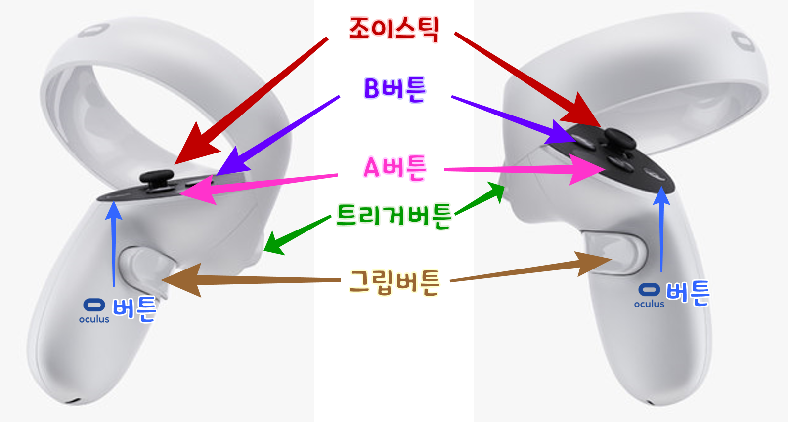

- 텔레포트
  - GoGung! 내에서는 **텔레포트**를 기능을 통해 이동할 수 있습니다.
  - 텔레포트 기능은 **좌측 조이스틱**을 **움직여** 가까운 위치에 **초록 마커**를 위치시키며, 조이스틱에서 **손을 떼면** 해당 위치로 이동할 수 있습니다.
- 화면 회전
  - 제자리에서 몸을 돌려 뒤를 보기 어렵다면 **화면 회전** 기능을 이용해 뒤를 볼 수 있습니다.
  - 화면 회전 기능은 **우측 조이스틱**을 좌, 우로 움직여 시계, 반시계 방향으로 약 45°씩 움직일 수 있습니다.
  - 화면 회전 기능은 텔레포트 도중에도 사용할 수 있습니다. 좌측 조이스틱을 움직여 놓지 않은 채로 우측 조이스틱을 움직이면 **텔레포트시 바라볼 화면**을 정할 수 있습니다.
- 클릭
  - **클릭**은 특정 상황에서 사용할 수 있는 기능입니다.
  - Oculus 화면 좌측 하단에 위치한 **대화창 아이콘**이나 씬(scene) 곳곳에 배치된 **족자에 쓰여진 글씨**를 **오른쪽 컨트롤러**로 **가리키**면 **검은 레이저**와 **포인터**가 나타납니다.
  - 검은 레이저 끝에 닿은 대상을 **오른쪽 컨트롤러**의 **A버튼**을 눌러 클릭할 수 있으며, 각각 **특정 기능이 실행**됩니다.
  - 대화창 아이콘은 **대화창을 켜고 끄는** 버튼과, **다음** **대화창으로** **넘기는** 버튼 2가지로 구성되어 있습니다.
  - 족자에 쓰여진 글씨를 클릭하게 되면 해당 내용을 읽어주는 **TTS**가  나오게 됩니다.
- 잡기
  - **잡기** 기능은 GoGung!에서 오브젝트와 할 수 있는 가장 기본적인 상호작용입니다.
  - 잡기는 **그립버튼**으로 **누름**으로써 행해지며 게임상에는 잡을 수 있는 여러 오브젝트가 있습니다. 
  - 해당 오브젝트는 북채, 징채를 비롯해 투호, 활과 화살, 술병과 술잔 등이 있습니다.
- 놓기
  - **놓기**는 누르고 있던 **그립버튼**을 **뗌**으로써 행해집니다.
  - 놓아진 오브젝트는 각 씬(scene)의 특징에 맞게 중력이 적용되는 것도, 그렇지 않은 것도 있습니다. 
- 던지기
  - **던지기**는 놓기의 확장형 행동입니다.
  - 잡은 오브젝트를 놓으면서 컨트롤러를 **휘두르**면 오브젝트를 **던질** 수 있습니다.
  - 던지기 기능은 **투호에만** 적용되어 있습니다.
- 쏘기
  - **쏘기**는 활을 잡은 상태에서 할 수 있는 행동으로 동시에 두개의 컨트롤러를 사용하는 기능 입니다.
  - **한 컨트롤러**로 활을 **잡은** 상태에서 **다른쪽 컨트롤러**로 화살을 **잡아** 활에 가까이 대면 화살이 자동으로 매겨집니다.
  - 그 후 활 시위를 **잡아** 몸쪽으로 당긴 뒤 **놓으면** **화살을 쏠** 수 있습니다.
- 생성하기
  * **생성하기**는 계속해서 소모되는 오브젝트를 생성하는 기능 입니다.
  * 생성할 수 있는 오브젝트로는 투호와 화살이 있습니다.
  * **투호**는 투호 항아리를 **오른쪽 컨트롤러**의 **트리거버튼**을 눌러 생성할 수 있습니다.
  * **화살**은 화살을 어깨에 맨 화살통에서 빼내듯이 **한 쪽 컨트롤러**를 등뒤로 들어 **그립버튼**을 누르면 잡힌 상태로 생성이 됩니다.

* 따르기
  * **따르기**는 액체가 담겨있는 오브젝트의 액체를 따르는 기능입니다.
  * 오브젝트를 **잡은** 채로 90° 이상으로 기울이면 액체를 따를 수 있습니다.
  * 따를 수 있는 오브젝트는 **술병** 뿐이며, 이 액체로 채울 수 있는 오브젝트는 **술잔** 뿐입니다.

- TTS
  - **TTS**는 환경을 감상하며 해설을 들을 수 있도록 추가한 기능입니다.
  - 상기에 작성된 대로 족자의 글씨를 오른쪽 컨트롤러의 A버튼으로 클릭하게 되면 해당 TTS를 들을 수 있습니다.

 

### 2. Scene

#### (1) 인트로 (Scene 0)

> 고궁 게임 및 컨트롤러 조작 안내

- 고궁
  - 스토리 텔링
    - "고궁"에 온 것을 환영합니다. 조선왕조 500년 역사가 담긴 경복궁을 VR로 체험할 수 있습니다. 전통문화 체험과 함께 궁궐 곳곳을 여행해보세요.
    - 당신은 경복궁으로 초대 받았습니다. 안내자를 따라서 경복궁 안을 돌아다니세요. 근정전, 왕실 정원, 그리고 궁궐 뒷산으로 이어지는 고궁 월드에서 전통놀이와 사냥을 즐겨 보세요.
  - 전통 문화 
    - 전통 악기 체험으로 북과 징을 연주해 볼 수 있습니다.
    - 전통 놀이 체험으로 투호놀이와 활쏘기를 통한 사냥을 해볼 수 있습니다.
    - 전통 음식 체험으로 청주 술 따르기를 해볼 수 있습니다.
- 컨트롤러 기본 동작
  - 텔레포트
    - "고궁"의 이동방식은 텔레포트입니다.
    - 텔레포트 기능은 **좌측 조이스틱**을 **움직여** 가까운 위치에 **초록 마커**를 위치시키며, 조이스틱에서 **손을 떼면** 해당 위치로 이동할 수 있습니다.
  - 레이저 포인터 클릭
    - Oculus 화면 좌측 하단에 위치한 **대화창 아이콘**이나 씬(scene) 곳곳에 배치된 **족자에 쓰여진 글씨**를 **오른쪽 컨트롤러**로 **가리키**면 **검은 레이저**와 **포인터**가 나타납니다.
    - 검은 레이저 끝에 닿은 대상을 **오른쪽 컨트롤러**의 **A버튼**을 눌러 클릭할 수 있으며, 각각 **특정 기능이 실행**됩니다.
    - 대화창 아이콘은 **대화창을 켜고 끄는** 버튼과, **다음** **대화창으로** **넘기는** 버튼 2가지로 구성되어 있습니다.
    - 족자에 쓰여진 글씨를 클릭하게 되면 해당 내용을 읽어주는 **TTS**가  나오게 됩니다.

#### (2) 광화문 및 근정전 (Scene 1)

> 전통 음악 체험 (북과 징 연주)

- 배경 - 광화문과 영제교를 거쳐 근정전으로! 전통 악기를 체험해 보세요!
  - 광화문
    - 이곳은 경복궁으로 가는 정문이자 가장 큰 문입니다. 광화문은 세종로의 북쪽 끝에 위치한 삼거리에 위치해 있습니다. 서울이 조선시대의 수도였다는 오랜 역사 알리는 상징이자 랜드마크임을 알리듯이 광화문은 수차례 파괴되고 다시 복구 되었습니다. 최근 가장 큰 규모의 복원작업이 진행되었고, 2010년 8월 15일에 다시 광화문이 열렸습니다.
  - 영제교
    - 영제교는 정문인 광화문을 지나 왕의 본전인 근정전으로 들어가기 위해 건너야 하는 다리입니다. 이 다리는 경복궁의 뒤에서 바로 흘러 들어오는 금천이라는 냇물을 가로지르는 다리입니다. 당시 백성들은 왕은 하늘에서 사람들을 통치하기 위해 선택된 신성한 존재로 여겼습니다. 백성들은 이 다리는 왕을 알현하기 위해 지나게 되면 심신이 정화된다고 믿었습니다. 다리의 난간에는 서수라고 하는 여러 상상의 생물들이 놓여있습니다.
  -  근정전
    - 근정전은 경복궁의 본전 입니다. 고관들이 이곳에 모여 왕의 새해의 안녕을 빌었습니다. 또한 이곳은 왕들이 국정을 수행하고, 제사를 지내거나 외국 사신을 접대하기 위해 사용하기도 했습니다.
  - 행각
    - 행각은 원래 하나였던 두 개의 복도가 있는 직사각형 모양의 행랑입니다. 이 스타일과 구조는 일반적으로 단순합니다. 사각형 창의 모서리를 비스듬하게 만들고 천장의 모든 재료를 노출시킨 것이 특징입니다. 행각은 현재 조선시대 궁궐의 남문 중 유일하게 남아있는 2층 건물입니다.
  - 전통 악기
    - 근정전에 위치한 악기들은 징, 북, 비파, 가야금으로 이루어져 있습니다. 모두 한국 전통 악기로서 구중음악에도 사용되었습니다. 북과 징은 주로 민속놀이인 사물놀이에 사용되었고, 궁중과 민간에서 폭 넓게 사용되었습니다.
  -  궁중 음식
    - 한식은 건강에 좋은 채소류와 육류로 이루어져 있습니다. 왕이 먹는 음식은 모두 사전에 검증을 거칩니다. 이를 '기미'라고 합니다.
- 컨트롤러
  - 타악기를 연주하기 위해 채를 집어보세요. 양손 중지 Trigger 를 이용해 채를 집을 수 있고 북과 징을 채로 칠 경우 연주할 수 있습니다. 앞에 놓인 악기들을 연주해보세요.

#### (3) 정원  (Scene 2)

> 전통 놀이 체험 (투호놀이 체험)

- 배경 - 향원정을 본따 만든 정원! 투호놀이와 청주를 체험할 수 있습니다.
  - 향원정
    - 향원정은 경복궁 북쪽 후원에 있는 향원지 내의 가운데 섬 위에 건립된 육각형의 정자입니다. 이 공간은 향원정을 본따 만들었습니다.  향원정의 향원은 향기가 멀리간다는 뜻으로 왕이나 왕족들이 휴식하고 소요하던 침전의 후원입니다.
  - 투호놀이
    - 투호는 고려시대인 1116년에 중국에서 한국으로 들어온 것으로 보이며, 예종 때 대중화 되었습니다. 요즈음에는 설날과 추석에 하는 전통놀이로 자리매김 하고 있습니다. 현대 버전은 단순한 용기와 끝이 고무로 된 화살이 이용되는 데, 사용되는 화살은 일반적으로 길이가 50~60cm이며 약 10발자국 거리에서 용기에 던져 넣습니다. 과거에 투호는 술게임으로 유명했습니다. 투호 통에 넣지 못한 사람은 불승이라는 이름으로 술을 마셔야 했습니다. 이 벌칙 대신 노래를 부를 수도 있습니다. 투호 통에 넣은 사람들은 현 이라고 불렀습니다. 
- 컨트롤러
  - 오른쪽 컨트롤러의 검지 Trigger 를 통해 화살을 재생성할 수 있습니다. 양쪽 컨트롤러의 중지 Trigger 를 통해 화살을 집을 수 있습니다. 앞에 놓인 넓은 항아리에 화살을 던져 넣어보세요.

#### (4) 산  (Scene 3)

> 전통 놀이 체험 (사냥 활쏘기 체험)

- 배경 - 신라시대 부터 이어져온 궁중 문화인 사냥을 체험해 보세요. 주어진 활에 화살을 매기고 야생 동물을 명중시켜보세요. 걱정 마세요. 단순히 사냥 체험을 위해 만들어진 가짜 사냥감입니다!
  - 사냥
    - 조선왕조실록에 따르면 왕족(보통 왕이나 세자)은 제사를 지낼 때나 손님을 접대할 때, 무술이 뛰어남을 보여주기 위해 사냥을 자주 다녔다고 기록되어 있습니다. 그 전통은 신라시대부터 이어져 온 것으로 알려져 있습니다. 
  - 호랑이
    - 일제강점기 이전에 호랑이는 우리나라에서 가장 흔한 야생동물로 가옥에 심각한 피해를 입히고 연간 수백 명의 목숨을 앗아갔기 때문에 호랑이를 사냥한 호랑이 사냥꾼에게도 포상을 주기도 했습니다.
- 컨트롤러
  - 화살을 집을 때는 컨트롤러의 중지 Trigger 를 사용하며 아무것도 집지 않은 상태에서 허공에서 중지 Trigger를 이용해 화살을 재생성 할 수 있습니다.
  - 화살과 활을 맞대면 결합되며 활 시위를 당겼다가 놓으면 그 힘에 비례하여 화살이 발사됩니다. 

#### (5) 정원  (Scene 4)

> 전통 음식 체험 (술상 청주 따르기 체험)

- 배경 - 사냥을 마치고 지친 당신을 위해 안주상을 마련했습니다. 정원의 정취와 함께 맛보세요.
  - 안주상
    - 안주상은 청주나 소주, 탁주 등 주류를 포함한 차림상입니다. 안주상에는 생선구이, 신선로, 탕이나 국과 같은 따뜻한 음식이나 회나 편육, 김치와 같은 찬 음식을 같이 냅니다. 이처럼 따뜻한 안주나 찬 안주 외에도 마른 안주, 진 안주도 있습니다.
  - 전통주와 안주
    - 한국 전통주에는 탁주와 청주, 소주가 있습니다. 2008년 농림수산식품부가 조사에 따르면 각 전통주와 어울리는 안주는 각각 다릅니다. 전통 탁주에 어울리는 안주는 빈대떡, 파전, 도토리 묵이고 전통 청주에는 생선회와 파전, 육회가 어울리며, 전통 소주와는 생선회, 삼겹살 구이, 홍합탕이 어울린다고 발표했습니다.
- 컨트롤러
  - 술병을 집을 때는 컨트롤러의 중지 Trigger 를 사용하며 술병을 기울여 액체를 따를 수 있습니다.
  - 액체가 술잔에 따를 경우 술잔에 술이 차오르게 되며 술잔을 들어 올릴 수 있습니다.

#### (6) 근정전 (Scene5)

> 엔딩 (족자 수여식)

- 배경 - 경복궁에서의 하루가 끝났습니다. 조선의 하루는 어떠셨나요?
  - 마무리
    - 경복궁에서의 하루를 마무리한 기념으로 경복궁 야간 개장 배경을 본따 만든 경복궁 야경을 준비했습니다. 주홍빛 등불에 비친 근정전을 감상하며 불꽃놀이를 즐기세요. 
    - 마지막으로 족자를 집어 게임을 끝내세요.
      당신은 오늘 '고궁'에서 한국의 전통 문화인 '활쏘기', '사냥', '투호', '안주상', '악기 연주' 등을 체험하였습니다. 조선에서의 하루는 어떠하셨나요? 즐거우셨다면 리뷰를 남겨주세요.
- 컨트롤러
  - 족자를 집을 때는 컨트롤러의 중지 Trigger를 사용해 족자의 손잡이를 잡아서 집을 수 있습니다.

 

## 3️⃣ 프로젝트 산출물

### 1. 이슈관리 (Jira)

#### (1) 현황 

#### (3) Team Burndown Chart

- 2주차

  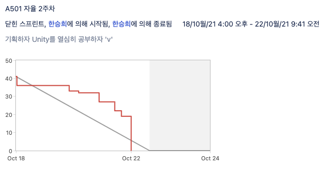

- 3주차

  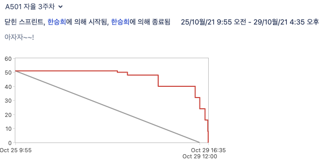

- 4주차

  

- 5주차

  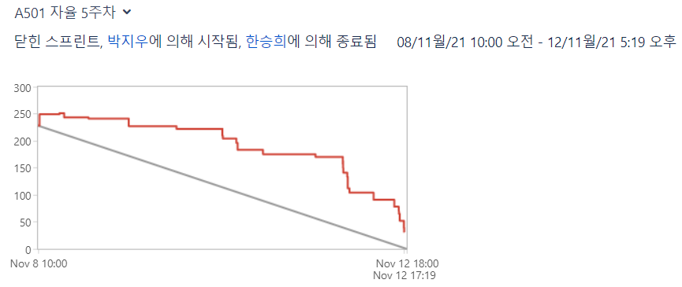

#### (4) Sprint 회고

- 3주차

  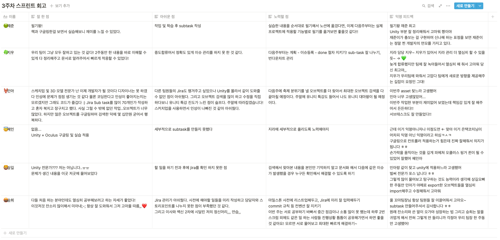

- 4주차

  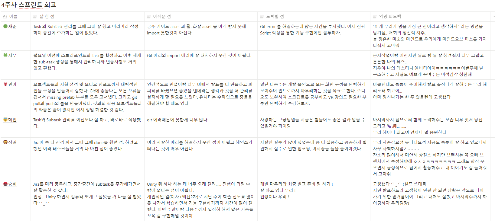

- 5주차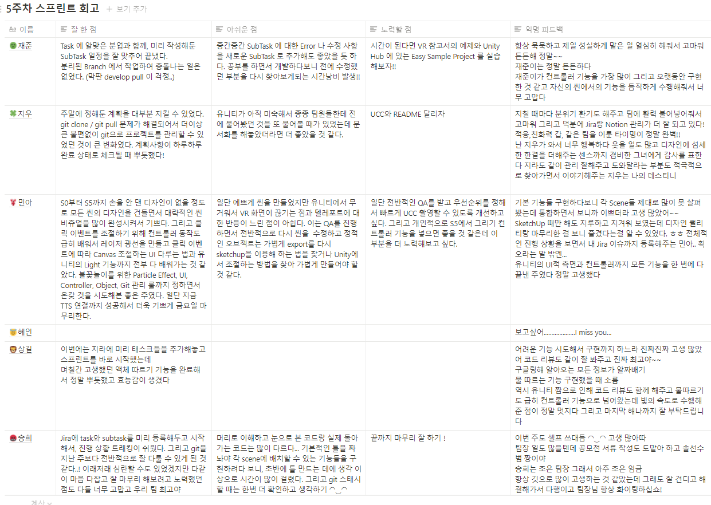

  

 

### 2. 형상 관리 (Gitlab)

#### (1) Convention

#### (2) Commit

#### 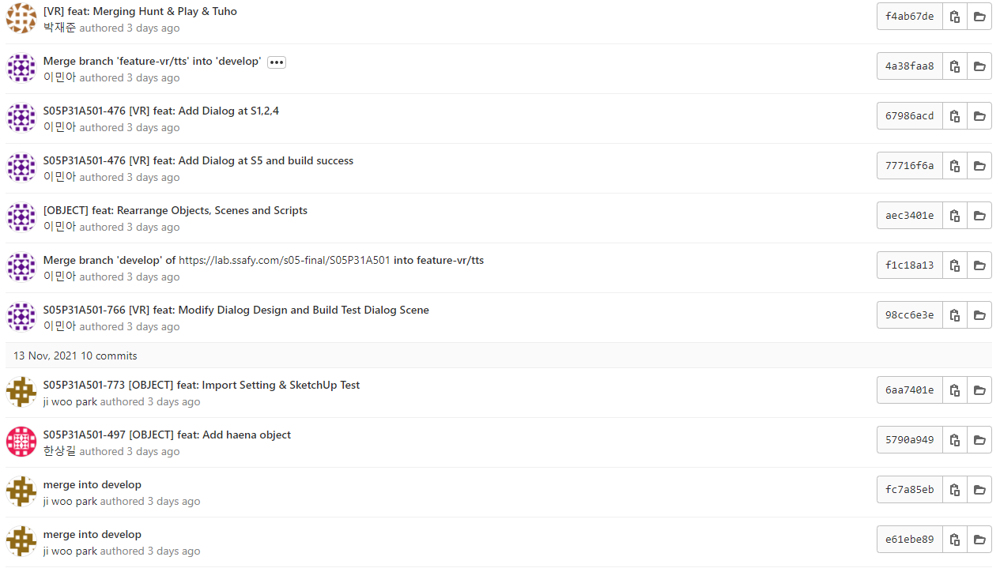

#### (3) Branch

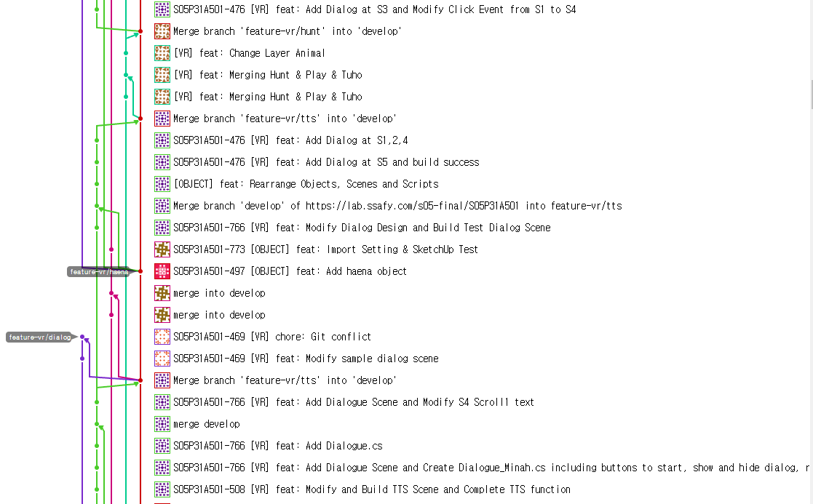

 

### 3. 커뮤니케이션

#### (1) Mattermost 

- Git/Jira Log

  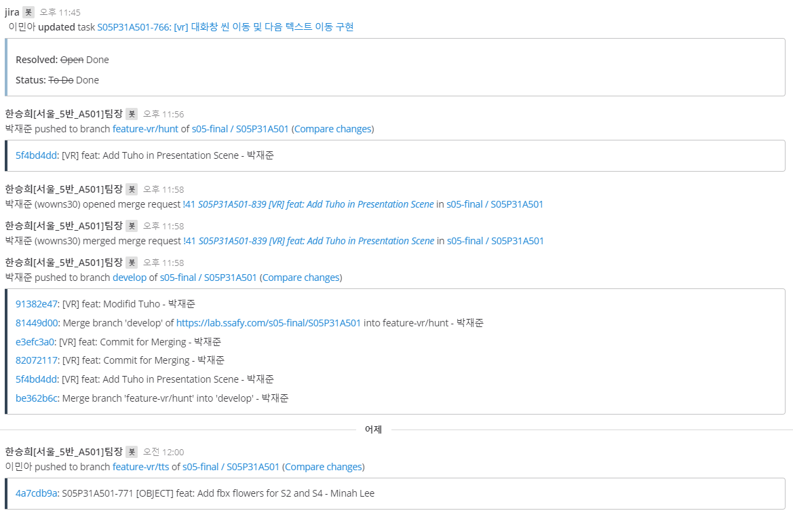

- Daily Scrum

  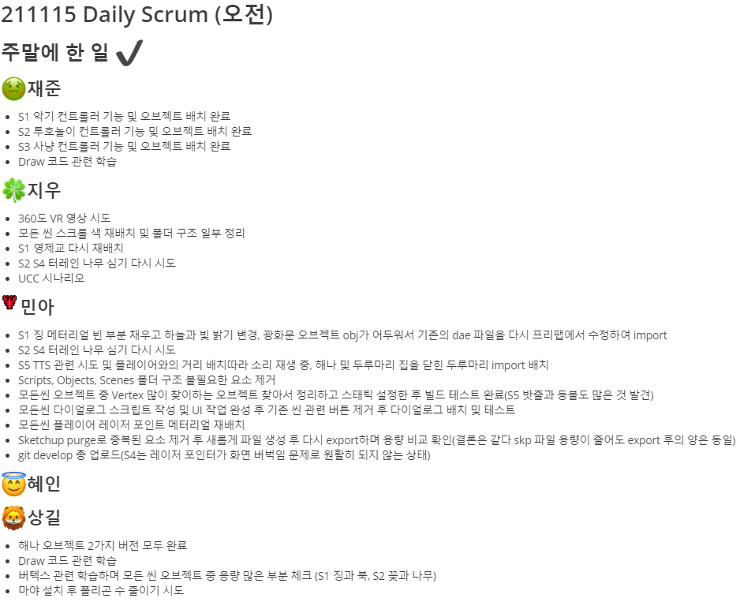

  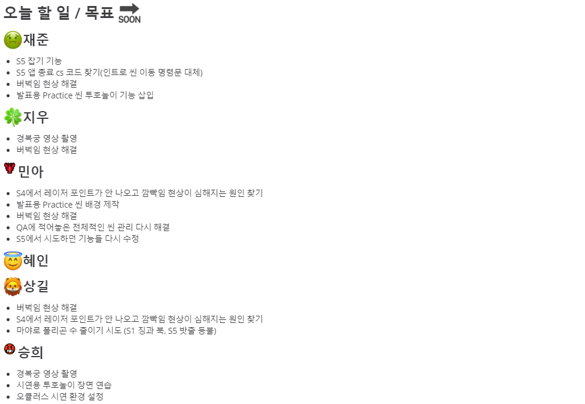

#### (2) [Notion]((https://devmd.notion.site/A501-c64871bbe81343aeba62ffd2db048087))

- 프로젝트 계획서

  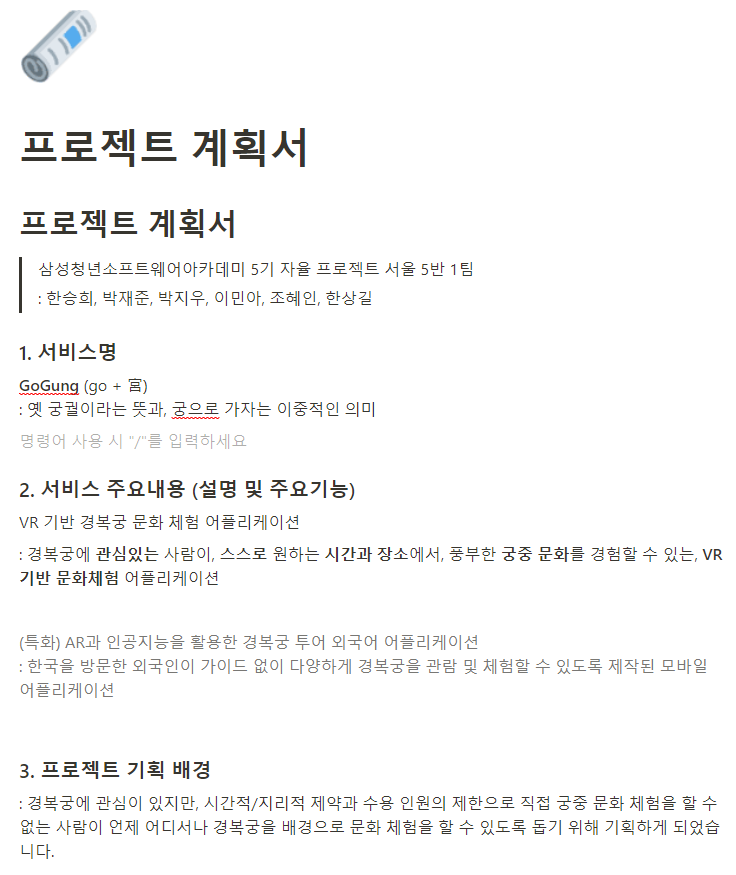

- 기능 명세서

  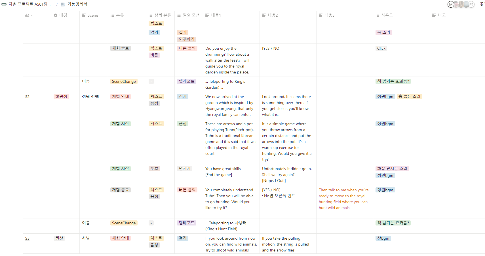

- 회의록

  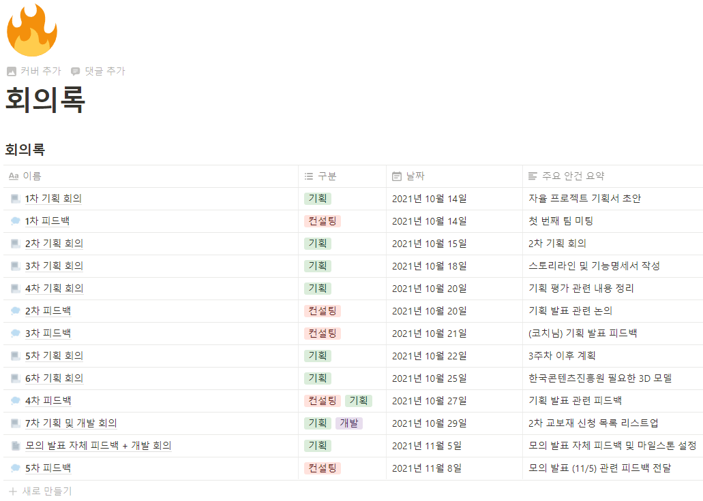

- 일정 관리

  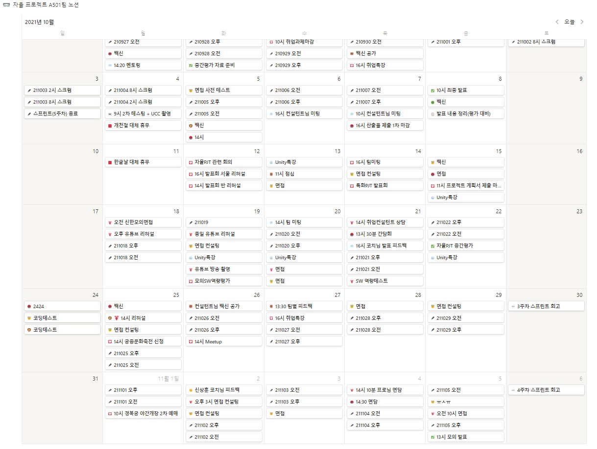

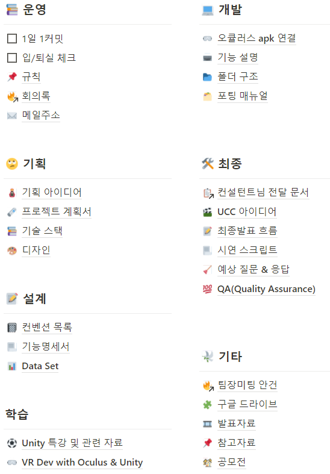

#### (3) Webex

 

### 4. apk 실행 가이드

> 외부에서 가져온 apk 파일을 Oculus 기기 자체에서 실행을 할 수 없으므로 Side Quest라는 프로그램을 이용

#### (1) Oculus Quest 등록

- 페이스북에 가입하고 휴대전화의 앱 스토어에서 Oculus를 검색하고 설치
- 휴대전화의 Oculus와 Oculus Quest 기기를 같이 킨 상태로 동기화(같은 와이파이 환경에 있어야 함)

#### (2) Oculus Quest 2

- 다음 링크로 이동하여 페이스북 계정을 개발자로 등록 [인증 - Oculus](https://dashboard.oculus.com/)
- 다음 순서로 Oculus 기기에서 개발자 모드 활성화

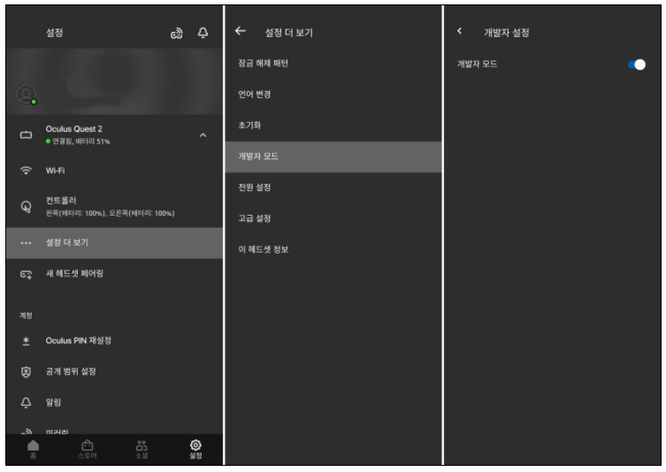

#### (3) Side Quest 설치

- 다음 링크에서 본인 PC의 OS에 맞는 Side Quest를 설치 [sidequestvr.com](https://sidequestvr.com/download)

#### (4) Oculus 기기 USB 디버깅 활성화

- PC와 Oculus 기기를 USB로 연결하기
- Oculus 기기 내에서 바로 팝업으로 뜨는 **USB 디버깅 활성화** 문구에 **'예'** 클릭
- PC와 Oculus 기기가 연결된 상태에서 Side Quest를 실행하여 왼쪽 상단에 연결이 잘 되었다는 의미의 초록 동그라미 확인

-16371329861901.png)

#### (5) apk 설치하기

- PC와 Oculus 기기가 잘 연결되어 있는 상태에서 Side Quest 프로그램에 apk 파일을 드래그
- 설치가 완료되면 Oculus 내의 앱 메뉴에서 오른쪽 상단의 **모두**를 클릭해 **알 수 없는 출처**로 변경
- 설치된 app을 실행

 

## 4️⃣ 프로젝트 결과물

[기획 발표](docs/presentation/서울_5반_A501_1차발표자료.pdf)

[최종 발표]()

  
